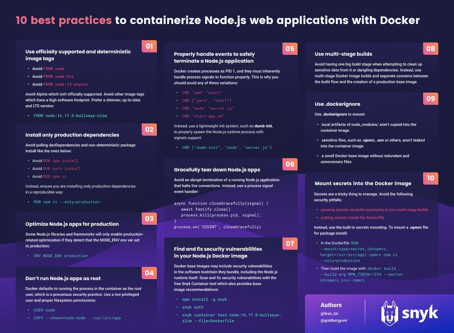

# Criando uma ideia de tratamento de erro

Estudo de uma forma de tratar de como tratar erro sem precisar usar try catch no controller e um pouco de docker

## Como executar o projeto

```cmd
  npm install
```

### Sem Docker

```bash
npm run start:dev
# or
npm run watch
```

### Usando o Docker

```bash
# criar a imagem
docker image build -t nodejs-tutorial .

## executar o container
docker container run -p 3000:3000 nodejs-tutorial
```

### Consultar api

```bash
# obter Pokemon por nome
curl http://localhost:3000/name/pikachu
```

## Docker files

O projeto possui 3 arquivo de Dockerfile:

- Dockerfile - usa o [Tini](https://github.com/krallin/tini#using-tini) para iniciar o processo do container
- Dockerfile sem Tini - o node inicia o processo do container
- Dockerfile dumb init - usa o dumb init para iniciar o processo do container

## Referências

- [Official Docker documentation](https://hub.docker.com/_/node/)
- [10 best practices to containerize Node.js web applications with Docker](https://snyk.io/blog/10-best-practices-to-containerize-nodejs-web-applications-with-docker/)
- [Node.js Docker Best Practices Guide](https://github.com/nodejs/docker-node/blob/main/docs/BestPractices.md)


